# ByteSync — Complete System Flowchart

> A real-time collaborative code editor built with **Next.js 16 + Clerk + Socket.IO + MongoDB**

---

## 1. High-Level System Architecture

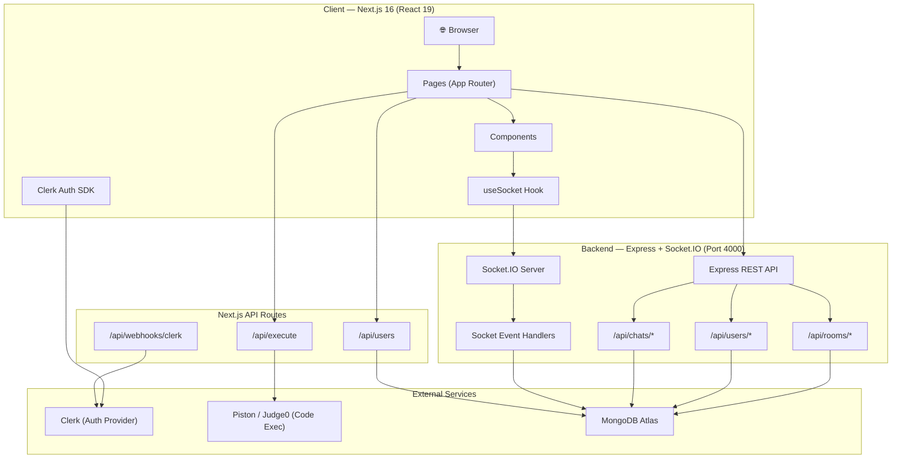

---

## 2. Application Entry & Routing

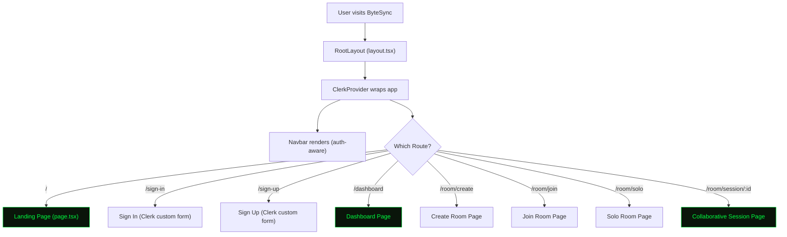

---

## 3. Authentication Flow

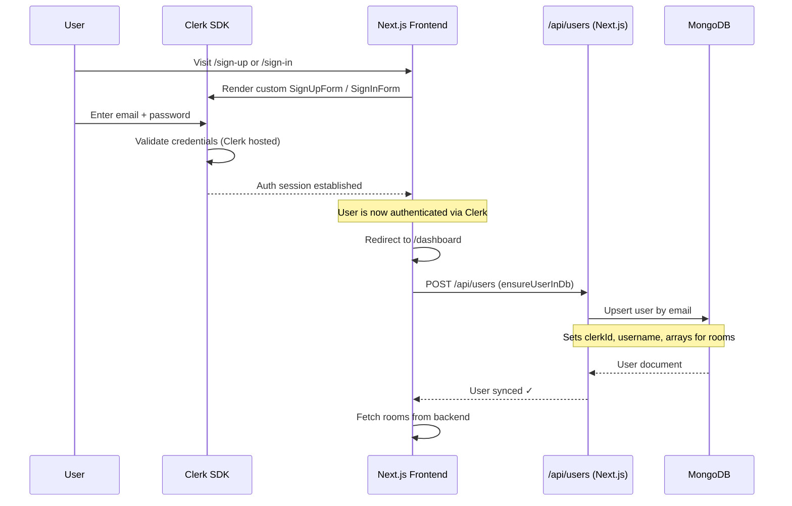

### Key Auth Details
- **Provider**: Clerk (`@clerk/nextjs`)
- **Custom forms**: `SignInForm.tsx` and `SignUpForm.tsx` with retro terminal aesthetic
- **User sync**: `ensureUserInDb()` POSTs to `/api/users` to upsert user in MongoDB
- **Guard**: Dashboard & room pages redirect to `/sign-in` if unauthenticated

---

## 4. Room Creation Flow

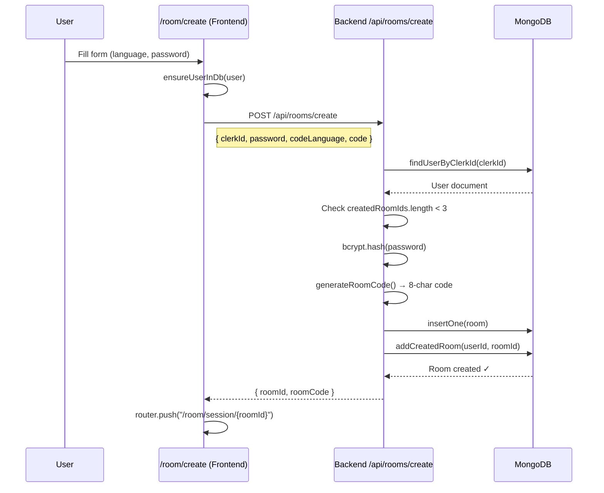

### Room Limits
| Constraint | Limit |
|---|---|
| Max rooms created per user | 3 |
| Max rooms joined per user | 3 |
| Max participants per room | 5 (+ owner) |
| Room code length | 8 characters (alphanumeric) |
| Password minimum | 4 characters |

---

## 5. Room Join Flow

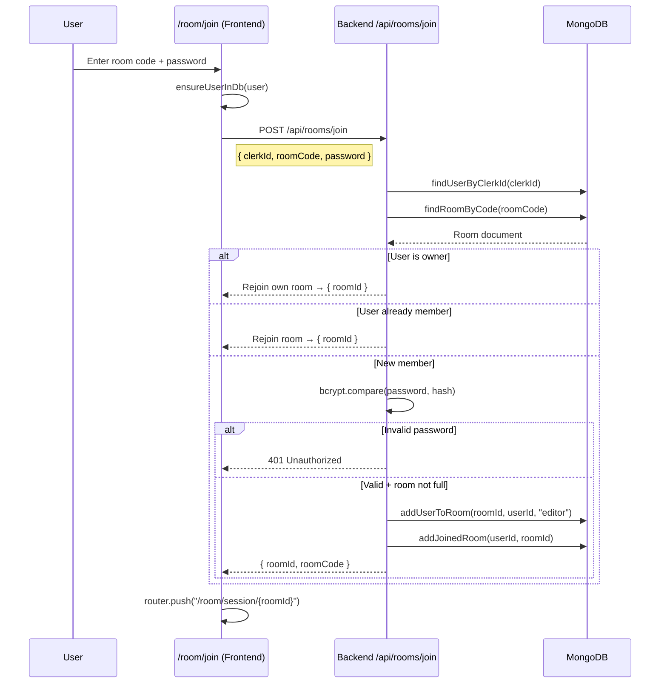

---

## 6. Collaborative Session — The Core Flow

This is the heart of ByteSync. The session page (`/room/session/[roomId]`) integrates everything.

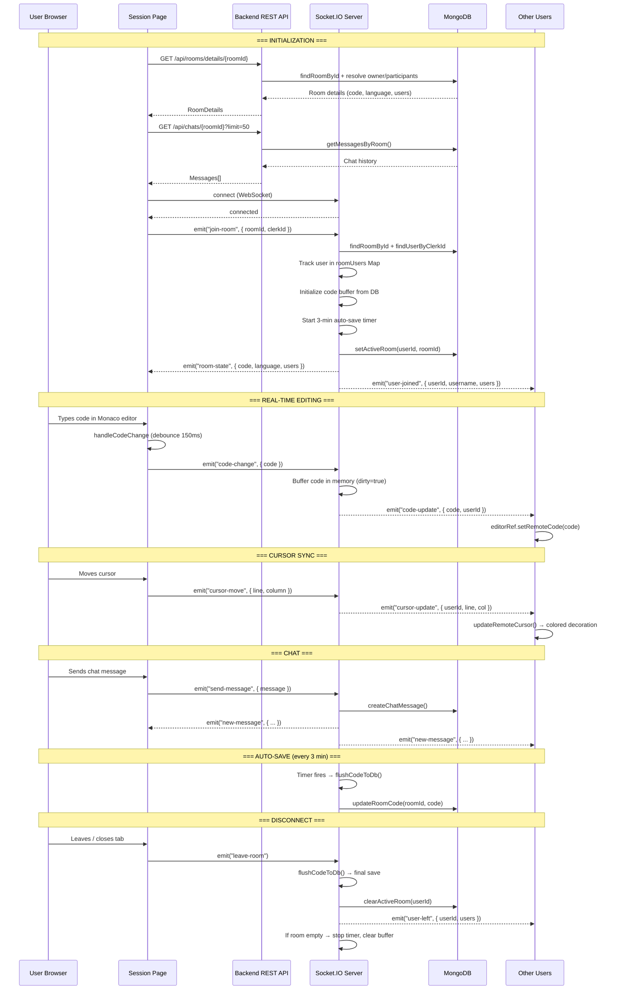

---

## 7. Code Execution Flow

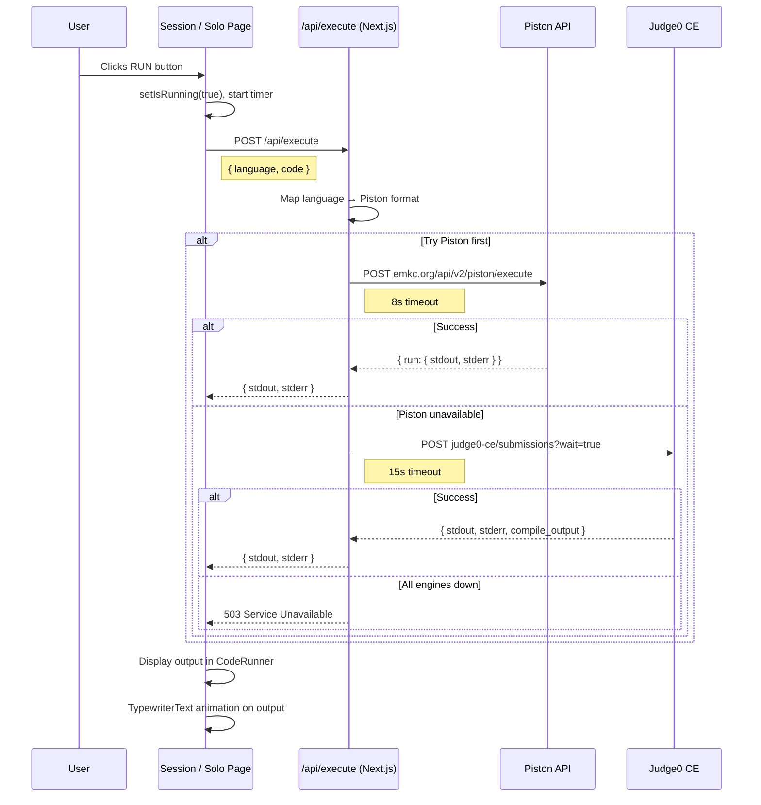

### Supported Languages
| Language | Piston ID | Judge0 ID |
|---|---|---|
| JavaScript | javascript | 63 |
| Python | python | 71 |
| TypeScript | typescript | 74 |
| C++ | c++ | 54 |
| Java | java | 62 |
| Go | go | 60 |
| Rust | rust | 73 |
| C | c | 50 |

---

## 8. Socket.IO Events Map

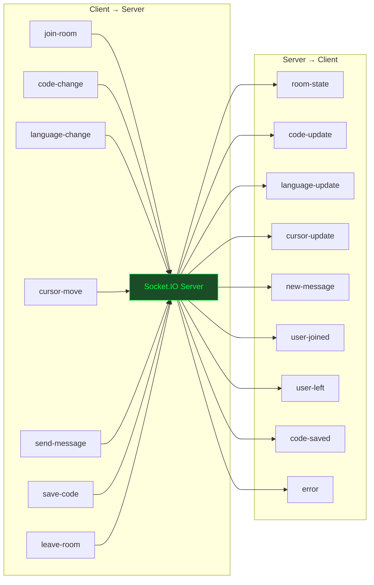

| Event | Direction | Payload | Purpose |
|---|---|---|---|
| `join-room` | C→S | `{roomId, clerkId}` | Join a room, receive state |
| `code-change` | C→S | `{code, codeLanguage?}` | Broadcast code edits |
| `language-change` | C→S | `{codeLanguage, code}` | Owner changes language |
| `cursor-move` | C→S | `{line, column}` | Sync cursor position |
| `send-message` | C→S | `{message}` | Send chat message |
| `save-code` | C→S | — | Manual save to DB |
| `leave-room` | C→S | — | Leave current room |
| `room-state` | S→C | `{code, codeLanguage, users}` | Initial room state |
| `code-update` | S→C | `{code, userId}` | Remote code change |
| `language-update` | S→C | `{codeLanguage, code, userId}` | Language changed |
| `cursor-update` | S→C | `{userId, line, column}` | Remote cursor |
| `new-message` | S→C | `{_id, senderId, message, createdAt}` | New chat message |
| `user-joined` | S→C | `{userId, username, users[]}` | User entered room |
| `user-left` | S→C | `{userId, users[]}` | User left room |
| `code-saved` | S→C | `{timestamp}` | Save confirmed |

---

## 9. Data Models (MongoDB)

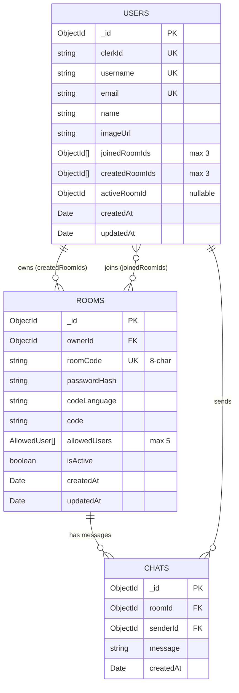

---

## 10. Component Hierarchy

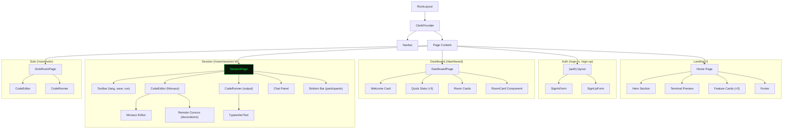

---

## 11. REST API Endpoints

### Next.js API Routes (Frontend Server)

| Method | Endpoint | Purpose |
|---|---|---|
| `POST` | `/api/users` | Upsert Clerk user into MongoDB |
| `POST` | `/api/execute` | Execute code via Piston/Judge0 |
| `POST` | `/api/webhooks/clerk` | Clerk webhook handler |
| `GET` | `/api/health` | Health check |

### Backend Express API (Port 4000)

| Method | Endpoint | Purpose |
|---|---|---|
| `POST` | `/api/rooms/create` | Create a new room |
| `POST` | `/api/rooms/join` | Join a room by code + password |
| `POST` | `/api/rooms/leave` | Leave a room |
| `GET` | `/api/rooms/details/:roomId` | Get room with resolved participants |
| `GET` | `/api/rooms/:roomCode` | Get room info by code |
| `GET` | `/api/rooms/user/:clerkId` | Get rooms owned by user |
| `DELETE` | `/api/rooms/:roomId` | Soft-delete room (owner only) |
| `GET` | `/api/users/:clerkId/rooms` | Get user's created + joined rooms |
| `POST` | `/api/users/set-active` | Set user's active room |
| `POST` | `/api/users/clear-active` | Clear user's active room |
| `GET` | `/api/chats/:roomId` | Get chat history (paginated) |

---

## 12. Auto-Save & Code Persistence Strategy

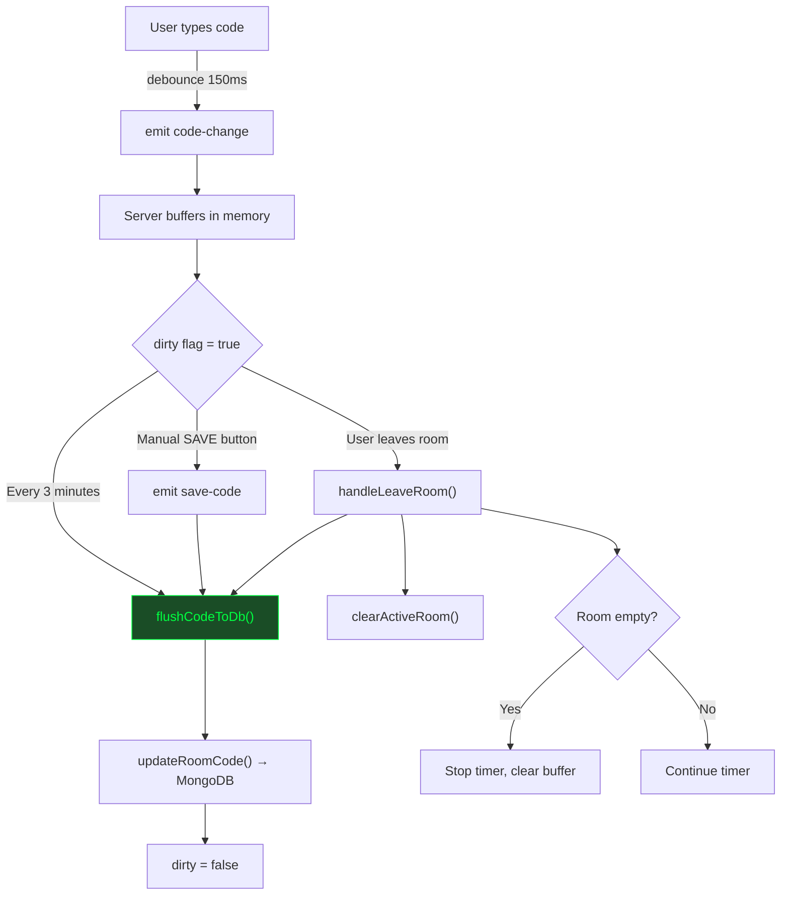

> [!IMPORTANT]
> Code is **never** written to MongoDB on every keystroke. It's buffered in-memory and flushed:
> 1. Every **3 minutes** via interval timer
> 2. On **manual save** (SAVE button)
> 3. When the **last user leaves** the room

---

## 13. Remote Cursor Sync Flow

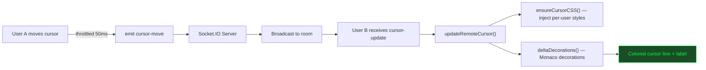

Each remote cursor has:
- **Colored vertical line** (2px border-left, pulsing animation)
- **Username label** above cursor (::after pseudo-element)
- **Highlighted line background** (subtle tint)
- **7 color palette** cycling per participant

---

## 14. Complete User Journey — End to End

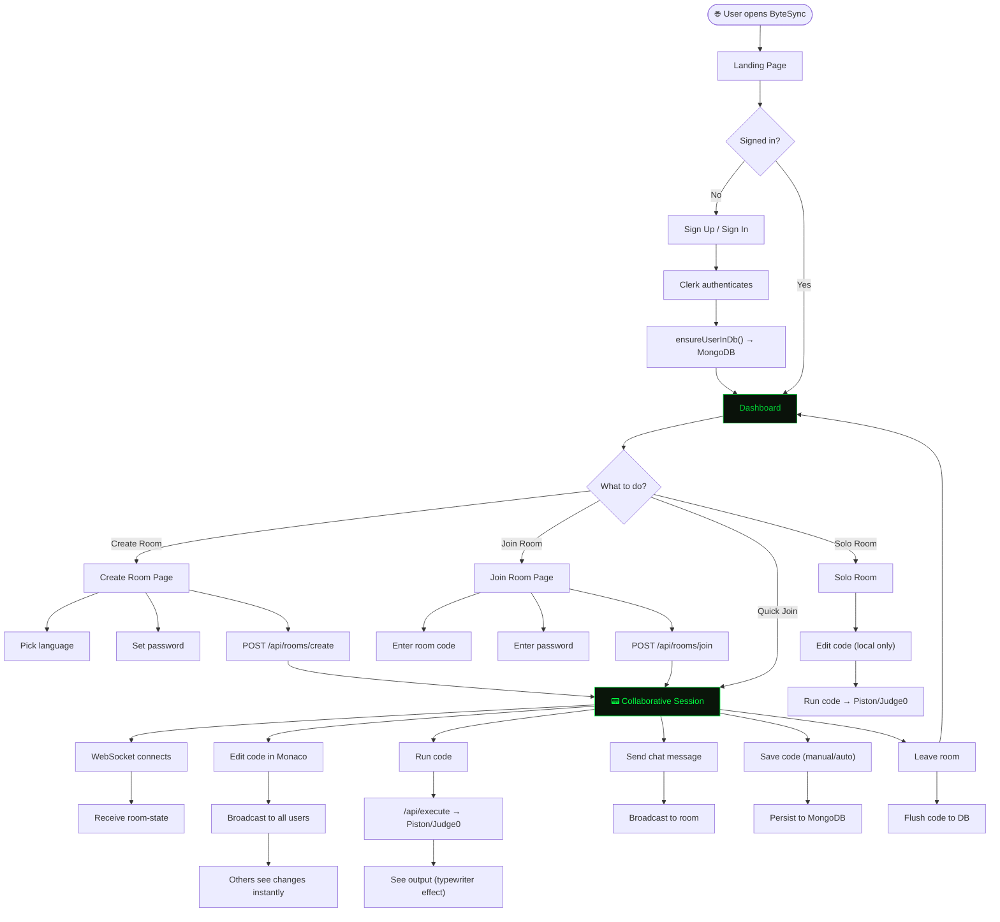

---

## 15. Tech Stack Summary

| Layer | Technology | Purpose |
|---|---|---|
| **Frontend** | Next.js 16, React 19, TailwindCSS 4 | App framework, UI |
| **Auth** | Clerk (`@clerk/nextjs`) | Authentication, user management |
| **Editor** | Monaco Editor (`@monaco-editor/react`) | Code editing with syntax highlighting |
| **Animations** | Framer Motion | UI transitions, chat bubbles, participant entrances |
| **Real-time** | Socket.IO (client + server) | WebSocket-based collaboration |
| **Backend** | Express.js + TypeScript | REST API server |
| **Database** | MongoDB (native driver) | User, Room, Chat persistence |
| **Code Execution** | Piston API + Judge0 CE | Remote code compilation & execution |
| **Validation** | Zod + React Hook Form | Form validation |
| **Styling** | CSS Variables + Dark/Light themes | Retro terminal aesthetic |
| **Fonts** | VT323 (mono display) + IBM Plex Mono | Terminal typography |
| **Deployment** | Docker + Vercel (FE) + Render (BE) | Production infrastructure |
